# ISO/IEC 27001:2022 ISMS Implementation Portfolio

> **Practical case study demonstrating hands-on exposure to ISMS planning, risk management, Annex A control mapping, implementation planning, audit and continual improvement.**

## About this portfolio

This repository presents a sanitised implementation case study based on an applied ISO/IEC 27001:2022 ISMS project for a fictionalised payment-services organisation, NorthPay Solutions Ltd.

It is designed to demonstrate how an ISMS can be taken from **business context and scope through risk assessment, treatment, control mapping, implementation, audit and continual improvement**.

**Important:** This portfolio is evidence of practical project exposure and implementation capability. It does not claim that the author independently certified NorthPay Solutions Ltd or performed activities that were outside the project role.

## Implementation flow

```mermaid
flowchart LR
    A[Business Context] --> B[ISMS Scope]
    B --> C[Asset Inventory]
    C --> D[Risk Assessment]
    D --> E[Risk Treatment]
    E --> F[Annex A Mapping]
    F --> G[Statement of Applicability]
    G --> H[Policies & Procedures]
    H --> I[Control Implementation]
    I --> J[Internal Audit]
    J --> K[Management Review]
    K --> L[Corrective Actions]
    L --> D
```



## What this demonstrates

- ISO/IEC 27001:2022 ISMS scoping and context analysis
- Stakeholder identification
- Asset-based information security risk assessment
- Likelihood × impact risk evaluation
- Risk treatment planning
- Annex A control mapping
- Statement of Applicability structure
- Information security policy development
- Data classification
- Implementation roadmap planning
- Internal audit planning
- PDCA continual improvement
- Evidence and traceability thinking

## Source basis

The case study source material documents **15 key assets and 18 risks**, with R-01 concerning potential theft of cardholder data through payment APIs identified as the highest priority. The source states that the risk assessment feeds the Statement of Applicability and implementation roadmap. 

The implementation material also describes an 18-month roadmap covering foundation/scoping, risk assessment and treatment, control implementation, audit/remediation and certification planning.

## Repository structure

```text
.
├── README.md
├── docs/
│   ├── 01-isms-scope.md
│   ├── 02-context-and-stakeholders.md
│   ├── 03-risk-management.md
│   ├── 04-statement-of-applicability.md
│   └── 05-implementation-roadmap.md
├── evidence/
│   ├── asset-register.csv
│   ├── risk-register.csv
│   ├── risk-treatment-plan.csv
│   └── soa-sample.csv
├── diagrams/
│   ├── isms-lifecycle.md
│   ├── risk-treatment-flow.md
│   └── control-traceability.md
└── templates/
    ├── risk-register-template.csv
    ├── policy-template.md
    └── corrective-action-register.csv
```

## Key evidence chain

| Capability | Evidence |
|---|---|
| Scope | `docs/01-isms-scope.md` |
| Context & stakeholders | `docs/02-context-and-stakeholders.md` |
| Risk assessment | `evidence/risk-register.csv` |
| Risk treatment | `evidence/risk-treatment-plan.csv` |
| Annex A / SoA | `evidence/soa-sample.csv` |
| Implementation planning | `docs/05-implementation-roadmap.md` |
| Audit & improvement | PDCA and audit sections |
| Traceability | `diagrams/control-traceability.md` |

## Disclaimer

All examples are sanitised and/or representative. No real customer data, credentials, secrets, production configurations or confidential organisational evidence should be placed in this public repository.
