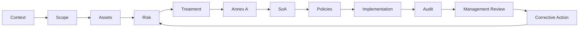

# ISMS Lifecycle

```mermaid
flowchart LR
A[Context] --> B[Scope]
B --> C[Assets]
C --> D[Risk]
D --> E[Treatment]
E --> F[Annex A]
F --> G[SoA]
G --> H[Policies]
H --> I[Implementation]
I --> J[Audit]
J --> K[Management Review]
K --> L[Corrective Action]
L --> D
```
