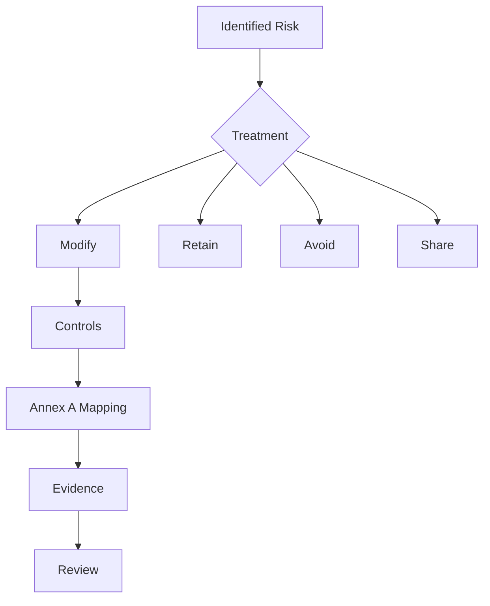

# Risk Treatment Flow

```mermaid
flowchart TD
A[Identified Risk] --> B{Treatment}
B --> C[Modify]
B --> D[Retain]
B --> E[Avoid]
B --> F[Share]
C --> G[Controls]
G --> H[Annex A Mapping]
H --> I[Evidence]
I --> J[Review]
```
