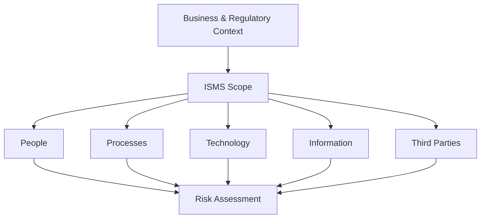

# 01 — ISMS Scope

## Purpose

Define the organisational and technical boundaries of the NorthPay Solutions Ltd ISMS.

## Scope summary

The case study covers:

- NorthPay Chester headquarters
- AWS cloud environment
- Azure identity services
- Cardholder Data Environment (CDE)
- Employees and contractors with access to in-scope systems/data
- Payment-processing services
- Information assets supporting payment operations

The source material identifies AWS Cloud, Azure Identity, staff/contractors, the CDE and payment-processing services as core scope elements.

## Scope boundaries

The portfolio treats unmanaged personal devices, merchant-owned infrastructure and supplier activities outside contractual obligations as outside the direct operational boundary, while recognising relevant supplier and contractual dependencies.

## Scope logic

## Relevant ISO/IEC 27001 clauses

- Clause 4.1 — Context of the organisation
- Clause 4.2 — Interested parties
- Clause 4.3 — Scope of the ISMS

## Portfolio evidence

The source presentation identifies the scope around AWS/Azure, staff and contractors, cardholder data, regulatory obligations and payment-processing services.
