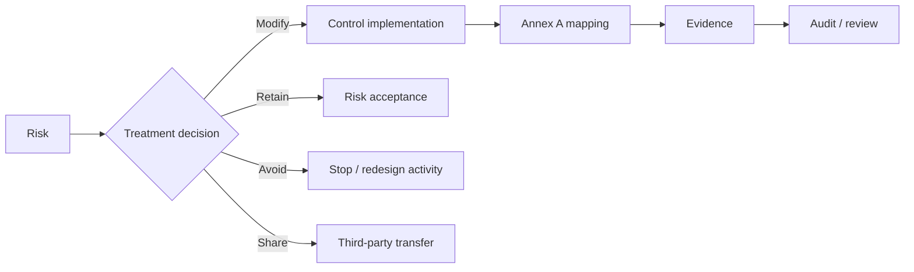

# 03 — Risk Management

## Method

The case study uses an asset-based risk process:

**Asset → Threat → Vulnerability → Likelihood → Impact → Risk Score → Treatment → Annex A Control → Owner → Evidence**

The source describes risk evaluation using likelihood and impact and states that risk score is based on these dimensions.

## Treatment options

| Option | Meaning |
|---|---|
| Modify | Apply controls to reduce risk |
| Retain | Accept the risk |
| Avoid | Stop the activity creating the risk |
| Share | Transfer/share the risk with a third party |

## Priority risk

**R-01 — Cardholder data stolen through payment APIs**

The source identifies R-01 as the highest-priority risk and states that it should be addressed in the first quarter.

## Representative risk register

See `evidence/risk-register.csv`.

The register intentionally includes only a concise representative set for the public portfolio. It should not be presented as the complete original risk register.

## Treatment traceability

## Risk governance

Risk owners, target dates, treatment status and residual risk should be maintained as living records rather than static documents.
