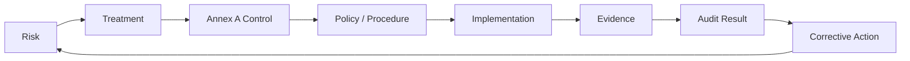

# 04 — Statement of Applicability

## Purpose

The Statement of Applicability (SoA) provides a structured link between identified information-security needs and applicable Annex A controls.

The source material states that recommended controls are mapped to ISO/IEC 27001:2022 Annex A and that the risk assessment feeds the SoA.

## Recommended SoA fields

| Field | Purpose |
|---|---|
| Control ID | Annex A reference |
| Control name | Control description |
| Applicable? | Applicability decision |
| Justification | Why the control is/is not applicable |
| Implementation status | Planned / Partial / Implemented |
| Control owner | Accountability |
| Evidence | Proof of operation |
| Review date | Governance |

## Sample

See `evidence/soa-sample.csv`.

The public repository uses a representative sample rather than reproducing all 93 Annex A controls.

## Traceability model

