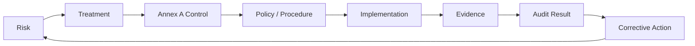

# 04 — Statement of Applicability

## Purpose

The Statement of Applicability (SoA) provides a structured link between identified information-security needs, risk treatment decisions, and applicable ISO/IEC 27001:2022 Annex A controls.

For this implementation case study, the risk assessment informs the selection and treatment of applicable controls. The SoA provides traceability between identified risks, selected controls, implementation activities, and supporting evidence.

The public repository uses a representative sample rather than reproducing all 93 Annex A controls.

## Recommended SoA Fields

| Field | Purpose |
|---|---|
| Control ID | ISO/IEC 27001:2022 Annex A reference |
| Control name | Control description |
| Applicable? | Applicability decision |
| Justification | Why the control is applicable or not applicable |
| Implementation status | Planned / Partial / Implemented |
| Control owner | Accountability for implementation |
| Evidence | Evidence demonstrating implementation or operation |
| Review date | Governance and review |

## Sample

A representative control sample is provided in:

`evidence/soa-sample.csv`

The sample demonstrates how control applicability, justification, ownership, implementation status, and evidence can be documented without publishing the complete control set.

## Traceability Model

