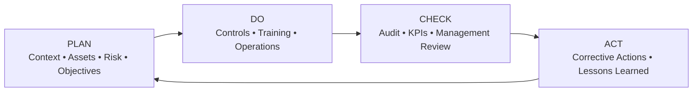

# 05 — Implementation Roadmap

## 18-month roadmap

| Phase | Months | Main outputs |
|---|---:|---|
| 1. Foundation & Scoping | 1–3 | Scope, IS policy, asset register, risk methodology, awareness |
| 2. Risk Assessment & Treatment | 4–6 | Risk workshops, risk register, treatment plan, draft SoA, third-party assessments |
| 3. Controls Implementation | 7–9 | MFA, access review, classification, IR improvements, SoA sign-off |
| 4. Audit, Review & Remediation | 10–12 | Internal audits, management review, corrective actions, gap analysis |
| 5. Certification | 13–18 | Stage 1, Stage 2, remediation and transition to BAU governance |

## Training and assurance

The source programme includes:

- ISMS awareness
- ISO 27001 fundamentals
- Secure coding
- Data classification
- Incident-response tabletop exercises
- Phishing simulations
- PCI DSS and GDPR refreshers
- Internal audits
- Management reviews

## PDCA

## Measures

Representative measures from the source include:

- MTTD / MTTR
- Patch compliance
- Training completion
- Audit findings
- Corrective actions
- Security monitoring coverage
